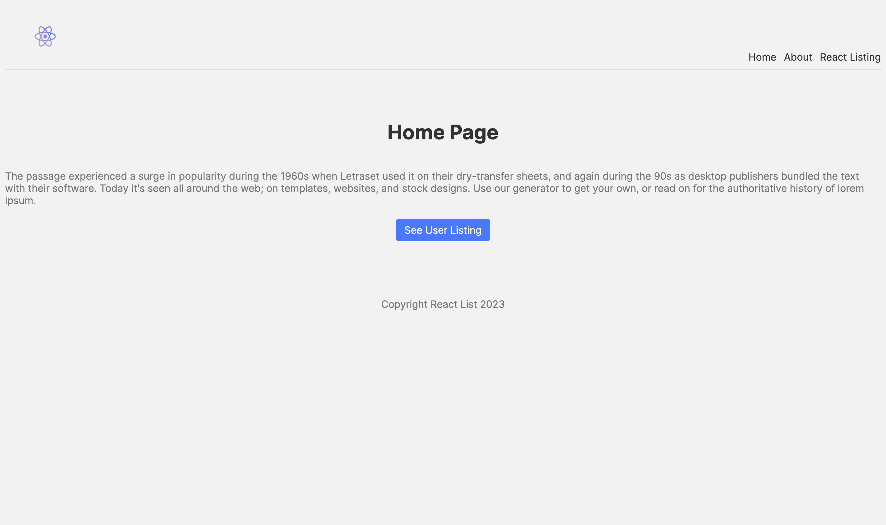
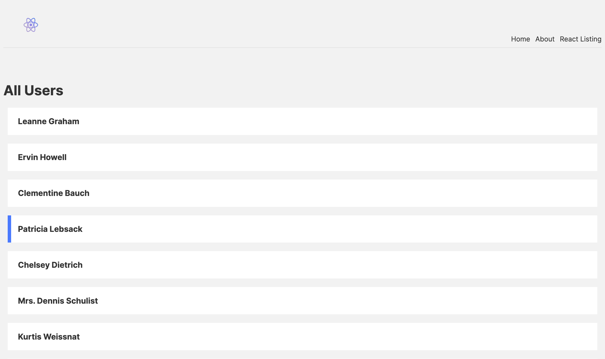

# User Listing Website built using Nextjs
---

### Author Links

👋 Hello there, I'm Joe Debrah

✅ [Check out my other Web Development portfolio here on Github](https://github.com/JoeDebrah).

---
---

🚀 Check out my Linkedin below:

- [Github](https://github.com/JoeDebrah)
- [LinkedIn](https://www.linkedin.com/in/joe-debrah-953972264/)

---
---

### Description

🛠️ This is an interesting project i built with the help of the resources available of the Next.js website. It is a simple website to display a bunch of users fetched from an external dummy api and was largely built with Next.js. 

---
## preview
HomePage

Users Page


---

🌅 [Check the preview_screenshots for a preview of the site](preview_screenshots) for this repository.

---
---
### 📚 Website References
- 🔗 [Bootstrap Official Website](https://getbootstrap.com/)

---

This is a [Next.js](https://nextjs.org/) project bootstrapped with [`create-next-app`](https://github.com/vercel/next.js/tree/canary/packages/create-next-app).

## Getting Started

First, run the development server:

```bash
npm run dev
# or
yarn dev
# or
pnpm dev
```

Open [http://localhost:3000](http://localhost:3000) with your browser to see the result.

